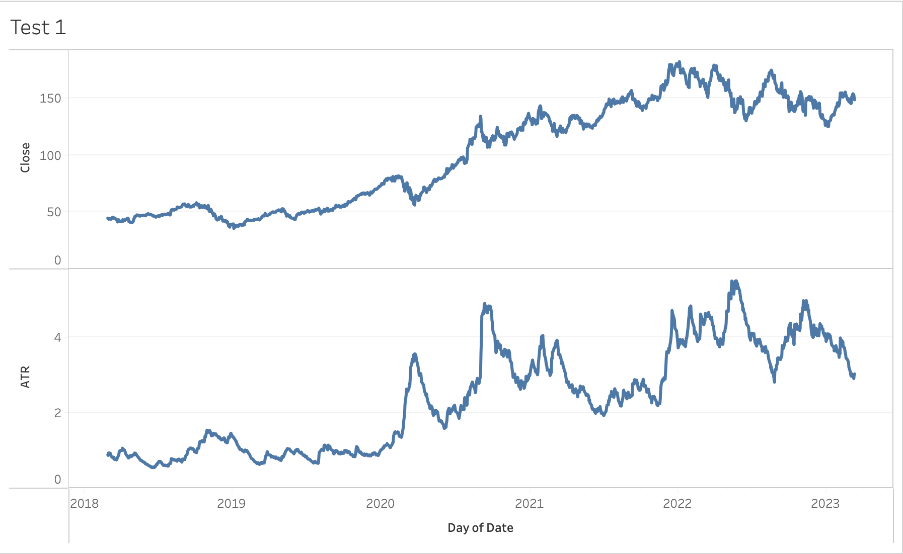

= ATR indicator calculation example =

Here is an example of calculation of average true range indicator using GO lang.

It reads input data from the file specified in the first command line parameter.
The file has to be in CSV format. Historical data from Yahoo! Finance can be
used for testing purposes. By default output is printed to STDOUT which may
be redirected to a file:

```
go run . AAPL.csv > AAPL+ATR.csv
```

Output contains data in CSV format similar to input plus additional column with
calculated ATR indicator.


